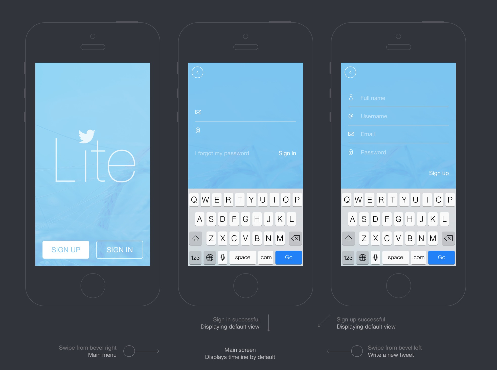

# 第四天 - Twitter Lite

我们今天来临摹 Sebastien Gabriel 大神的 [Twitter Lite](http://sgabriel.dunked.com/twitter-lite) 客户端设计。

值得注意的一件事是大神如何把所有的设计页面规划成一个流程图

详情：[Twitter Lite PSD 文件下载](http://sebastien-gabriel.com/freebies/twitter-lite.zip)

线型图像可以从 Mkrko Monti 的 [100+ free icons](https://dribbble.com/shots/1344983-Simple-Line-Icons-100-free-icons-Ai-Eps-Svg-Psd).

[图像下载链接](https://dribbble.com/shots/1344983-Simple-Line-Icons-100-free-icons-Ai-Eps-Svg-Psd/attachments/195525)

***

### 温馨提示

> 每个页面都应该有自己的 Artboard。

按 A 创建新的 Artboard。记得给 Artboard 命名。

> 用 masking 功能做出圆形头像：

<video src="04-round-profile-image.mp4" width="100%" controls=true></video>