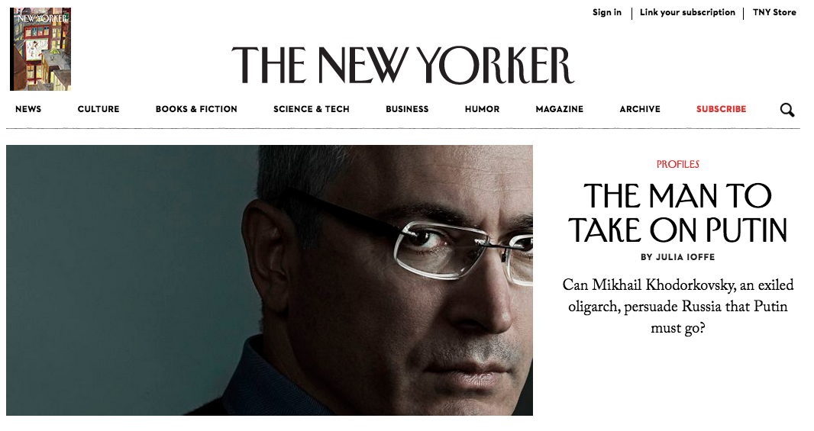

# 第五天 - 字体

字体是一个好的设计的幕后功臣。我们要怎么选择一个好看的字体呢？

“选择好看的字体” 其实是一个伪命题。你完全可以限制自己只用几种常见的 non-serif 字体：

+ Helvetica Neue
+ Roboto
+ Avenir Next
+ Open Sans

随便选一个看起来顺眼的就可以了 （不要选两个！）。

字体的使用更重要的是排版。标题和文案的相对大小，段落之间的空格，每一行字的空格。很多设计师说有了足够的空白一个设计才有呼吸的空间。空白和间隔在字体的应用上尤其重要。

我们今天的练习是来临摹 [Google Trend 2014](https://www.google.com/trends/2014) 的主页。

这个主页只用了 Roboto 这个字体。同样的 Roboto, thin 和 regular 有很大的差别。临摹的时候用心体会一下空白在排版设计扮演的一个重要角色。

## serif vs non-serif

serif 就是线条结尾的翘边。传统手写都有这些翘边，所以 serif 字体比较有传统，古典的感觉。

non-serif 字体没有翘边，现代感比较强烈。

## 同个字体会有不同的设计

调整字体大小粗细可能是以数位手段计算出来的。但用特殊的字体会有更好的效果。 [Thinking with Type](http://www.thinkingwithtype.com/contents/letter/) 举了一个 Garamond 的例子。

不同大小的 Garamond 有各自的设计，虽然都是同一个风格:

注意，Display 的线条比较细，适合 14pt 或更大的尺寸，但 10pt 以下看起来就就太细了。Regular 是相反的问题。

## 混搭字体

常见的混搭通常都是标题用一种字体，文案用一种字体。除了这种场景你想要搞创意的话请三思而后行。

我们来看看 New Yorker 杂志的字体混搭：

文章的标题用了 `ny-irving-heading` 这个字体，是一个很少见，个性特别强的字体。选择它的原因是因为和商标是一样的风格。

文字本身用了 caslon, 一个四平八稳，可读性很高的字体。

随便开了几个我常逛的网站调查有没有混搭字体：

+ [Medium](https://medium.com/) 没有混搭
+ [Harper's Magazine](http://harpers.org/) 没有混搭
+ [The Economist](http://www.economist.com/) 混搭
+ [The New York Review of Books](http://www.nybooks.com/) 混搭

反正别为了用不同的字体而用不同的字体。

## 标题 vs 文案

标题可以使用风格强烈的字体，给你的设计添加一些个性。

文案千万要用一个可读性高的字体，要不然别人看了会眼瞎。

## 奇怪的字体

不要用。

# 衍生阅读

[Thinking With Type](http://www.thinkingwithtype.com/contents/letter) 对字体有深入的介绍。大力推荐！

