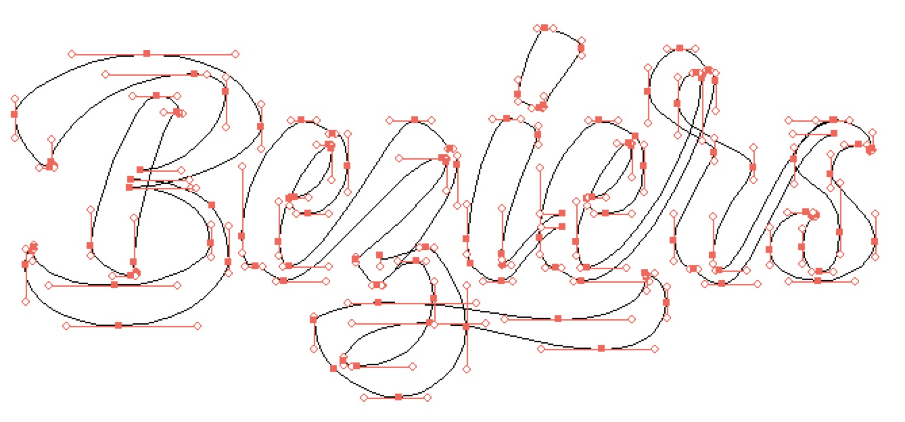

# 第七天 - 性感的贝塞尔曲线

既然提到了矢量绘图，就不得不说贝塞尔曲线。光有直线的世界自然是不够的，掌握好了曲线才能设计出优美的形状。

首先我们来了解贝塞尔曲线的一些属性和基本操作。[Mastering the Bézier Curve in Sketch](https://medium.com/sketch-app/mastering-the-bezier-curve-in-sketch-4da8fdf0dbbb) 针对 Sketch 有不错的介绍。

这篇文中做了个十分精美的动画，[Cubic Bezier Curves - Under the Hood](http://vimeo.com/106757336)

我们其实不太需要去了解贝塞尔曲线的数学原理，怎样用好贝塞尔曲线没有别的办法。

多练练呗~

##练习

原理了解一下就好。重点还是怎么用。

下面这个视频演示了怎样用贝塞尔曲线描绘 Evernote 的图标。

+ [Draw Evernote Icon with Bezier Curve](http://embed.wistia.com/deliveries/e3656cc3e22db2f8bd1e12c0b921d97a71dd94ce/119808.mp4)

小伙伴们跟着视频都练一下，难度不高。描这张图：

贝塞尔曲线的奥秘就是控制杆（handles)。怎样有秩序地放置控制杆是个让人纠结的问题。去看很多矢量绘图的大牛的构图你会发现他们的控制杆大多是垂直或者水平。这是个行业中的小秘密。看看这篇文体会一下： *HVBH* [Horizontal & Vertical Bezier Handles](http://theagsc.com/community/tutorials/so-whats-the-big-deal-with-horizontal-vertical-bezier-handles-anyway)。

依照这种做法，我们尽可能的将控制杆维持为水平或者竖直。这样一方面能减少了我们的选择，另外以方面也方便管理所有的控制点。效果如图所示:

跟着做一次，你会发现一次你只需要去更改控制杆的其中一点。描绘下面这个图当做练习:

> 这篇练习作者是 [CJ Ting](http://dingxijin.me)

