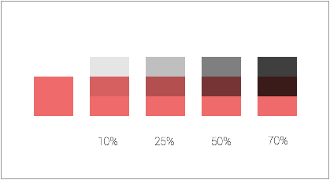

# 第三天 - 配色

码农做设计最头疼的问题之一就是配色。我们的色彩美感估计都是代码高光培养出来的。

理论至上的我们可能很直觉地就会想到去了解色彩理论。我看了色彩理论，还是不会配色。怎么破呢？

Meng To 的 [Experimenting with Colors and Concepts](http://blog.mengto.com/experimenting-colors-concepts/) 给了我很大的启发。

最容易上手的配色方法就是找一张自己[喜欢的设计](https://dribbble.com/colors/66cccc), [唱片封面](https://www.google.com/search?q=album+art&es_sm=91&source=lnms&tbm=isch&sa=X&ei=NaKmVM7FIZXZoATE9oDQDg&ved=0CAgQ_AUoAQ&biw=1312&bih=863), 或者[照片](https://500px.com/), 然后从这些作品里面选出几个颜色。

假如你找的作品色彩协调，从里面选出来的颜色就不会太夸张。

有了几个主色之后可以在他们的基础上面配出各个明暗度，用在不同的 UI 元素上。

练习：

1. 找一个喜欢的作品。
2. 以你选的作品来创建一个配色。

最后，你可用 sketch 把你的配色做一个好看的排版。我的排版：

恭喜恭喜，你已经具备能力去为土豪公司做品牌配色了。

### 几个有关颜色的温馨提示

> 选主色的时候饱和度（saturation）不要太高。

在真实世界高饱和度的颜色是很少见的，所以在设计里出现感觉不自然。

> 不要用纯灰色

当你的 UI 需要用灰色的时候，最好把主色的饱和度调低到接近灰色。这样你的灰色会有一点点的色彩，让整体设计更和谐。

字体除外 （吧。。。）

> 一个主色可以调出各种阴暗度，用在不同的 UI 元素上

调暗主色的方法：

1. 在一个色块上面覆盖黑色的色块
2. 然后降低黑色色块的透明度

如下 (数字代表黑色方块的透明度)：

调亮主色可以这样做:

1. 在主色下面放一个白色色块
2. 降低主色的透明度

> Make Grid 功能可以快速的创建小方格

+ 右击工具栏，点击 `Customize Toolbar`, 把 Make Grid 的功能添加到工具栏里

<video src="make-grid.mp4" controls=true width="100%"></video>
